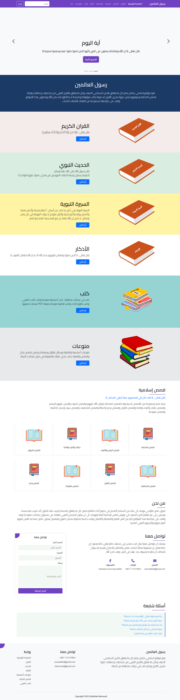

# 📖 Rasoul Al-Alameen

**Rasoul Al-Alameen** is a comprehensive Arabic Islamic website designed to spread authentic Islamic teachings.  
The website presents rich Islamic content in a clean, modern, and fully responsive interface with full **RTL (Right-to-Left)** support.

---

## 🌐 Live Demo
🔗 https://your-project-name.netlify.app  
*(Replace this link with your actual Netlify URL)*

---

## ✨ Features

- 🌙 Fully Arabic interface with RTL support
- 📱 Responsive design for all devices
- 🎠 Interactive carousel:
  - Verse of the Day
  - Hadith of the Day
  - Dhikr of the Day
- 📖 Islamic sections:
  - Holy Quran
  - Prophetic Hadith
  - Seerah (Biography of Prophet Muhammad ﷺ)
  - Athkar (Daily Remembrances)
  - Islamic Stories
  - Books (PDF-ready)
  - Islamic Miscellaneous Content
- 📩 Contact form
- ⚡ Optimized performance using WebP images
- 🎨 Modern UI using Bootstrap RTL

---

## 🛠️ Technologies Used

- HTML5
- CSS3
- Bootstrap 5 (RTL)
- JavaScript
- jQuery
- Font Awesome
- Google Fonts (Cairo)

---

## 📂 Project Structure

rasoulallah/
│── index.html
│── assets/
│ ├── css/
│ │ └── style.css
│ ├── images/
│ │ ├── section-icons/
│ │ └── cards/
│── js/
│ └── main.js

## Screenshots

### Home Page

## 🌐 Live Demo
 
[Rasoul Al-Alameen Website Live](https://rasoul-al-Alameen.netlify.app )

## Author
Abdullah Mohammed Abdullah Alamoudi
ASP.NET Core Developer

Email: abdullah.alamodi99@gmail.com
GitHub: https://github.com/Abdullah-Alamodi99

